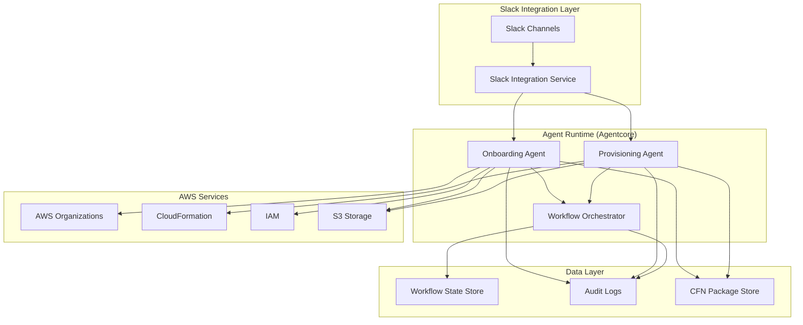
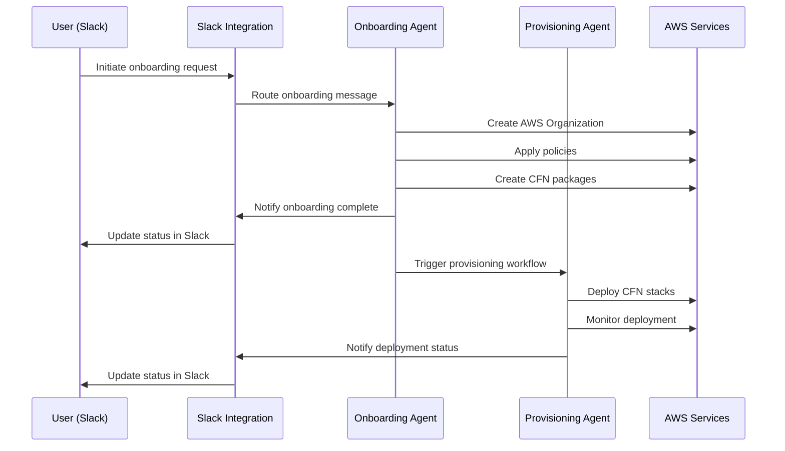

# Design Document: Agent-based Onboarding and Provisioning System

## Overview

The Agent-based Onboarding and Provisioning System is a distributed multi-agent architecture built on agentcore and strands frameworks. The system consists of two primary agents that collaborate to automate AWS customer onboarding and infrastructure provisioning workflows through Slack integration.

The system follows an event-driven architecture where agents communicate through message passing and maintain workflow state through the strands orchestration framework. All user interactions occur through Slack, providing a familiar interface for operations teams while maintaining full audit trails and workflow visibility.

## Architecture

### High-Level Architecture



### Agent Communication Flow



## Components and Interfaces

### Slack Integration Service

The Slack Integration Service acts as the primary interface between users and the agent system.

**Core Responsibilities:**
- Authenticate with Slack using OAuth 2.0 and bot tokens
- Route incoming messages to appropriate agents based on intent classification
- Format and send agent responses back to Slack channels
- Maintain conversation context and thread management
- Handle Slack API rate limiting and error recovery

**Key Interfaces:**
```typescript
interface SlackIntegration {
  sendMessage(channelId: string, message: string, threadId?: string): Promise<void>
  routeMessage(message: SlackMessage): Promise<AgentResponse>
  authenticateBot(): Promise<boolean>
  createThread(channelId: string, initialMessage: string): Promise<string>
}

interface SlackMessage {
  channelId: string
  userId: string
  text: string
  threadId?: string
  timestamp: string
}
```

### Onboarding Agent

The Onboarding Agent manages AWS organizational setup and CloudFormation package creation.

**Core Responsibilities:**
- Create and configure AWS organizational units and member accounts
- Apply organizational policies and security constraints
- Generate CloudFormation packages based on customer requirements
- Validate package integrity and compliance
- Version and prepare packages for deployment

**Key Interfaces:**
```typescript
interface OnboardingAgent {
  createOrganization(config: OrganizationConfig): Promise<OrganizationResult>
  applyPolicies(orgId: string, policies: PolicySet): Promise<PolicyResult>
  createCFNPackage(requirements: CustomerRequirements): Promise<CFNPackage>
  validatePackage(packageId: string): Promise<ValidationResult>
  versionPackage(packageId: string): Promise<string>
}

interface OrganizationConfig {
  customerName: string
  accountEmail: string
  organizationalUnits: string[]
  billingConfiguration: BillingConfig
}

interface CFNPackage {
  packageId: string
  version: string
  templates: CloudFormationTemplate[]
  parameters: ParameterSet
  dependencies: string[]
}
```

### Provisioning Agent

The Provisioning Agent handles CloudFormation deployment and monitoring.

**Core Responsibilities:**
- Retrieve validated CloudFormation packages
- Deploy CloudFormation stacks to target AWS accounts
- Monitor deployment status and progress
- Verify resource creation and configuration
- Handle deployment failures and rollback procedures

**Key Interfaces:**
```typescript
interface ProvisioningAgent {
  retrievePackage(packageId: string, version: string): Promise<CFNPackage>
  deployStack(packageId: string, targetAccount: string): Promise<DeploymentResult>
  monitorDeployment(deploymentId: string): Promise<DeploymentStatus>
  verifyResources(deploymentId: string): Promise<VerificationResult>
  rollbackDeployment(deploymentId: string): Promise<RollbackResult>
}

interface DeploymentResult {
  deploymentId: string
  stackId: string
  status: 'INITIATED' | 'IN_PROGRESS' | 'COMPLETE' | 'FAILED'
  startTime: Date
}

interface DeploymentStatus {
  deploymentId: string
  currentStatus: string
  progress: number
  resourcesCreated: number
  resourcesFailed: number
  estimatedCompletion?: Date
}
```

### Workflow Orchestrator (Strands Framework)

The Workflow Orchestrator manages multi-agent workflows and state persistence.

**Core Responsibilities:**
- Coordinate workflows spanning multiple agents
- Maintain workflow state and checkpoints
- Handle agent failures and recovery
- Provide workflow monitoring and metrics

**Key Interfaces:**
```typescript
interface WorkflowOrchestrator {
  startWorkflow(workflowType: string, input: WorkflowInput): Promise<string>
  getWorkflowStatus(workflowId: string): Promise<WorkflowStatus>
  resumeWorkflow(workflowId: string, checkpoint: string): Promise<void>
  cancelWorkflow(workflowId: string): Promise<void>
}

interface WorkflowInput {
  customerRequirements: CustomerRequirements
  targetAccount: string
  notificationChannels: string[]
}
```

## Data Models

### Customer Requirements
```typescript
interface CustomerRequirements {
  customerId: string
  customerName: string
  contactEmail: string
  infrastructure: InfrastructureSpec
  compliance: ComplianceRequirements
  timeline: ProjectTimeline
}

interface InfrastructureSpec {
  regions: string[]
  services: AWSServiceSpec[]
  networking: NetworkingConfig
  security: SecurityConfig
  scalingRequirements: ScalingSpec
}
```

### Workflow State
```typescript
interface WorkflowState {
  workflowId: string
  type: 'ONBOARDING' | 'PROVISIONING'
  status: 'PENDING' | 'IN_PROGRESS' | 'COMPLETED' | 'FAILED' | 'CANCELLED'
  currentStep: string
  checkpoints: Checkpoint[]
  metadata: Record<string, any>
  createdAt: Date
  updatedAt: Date
}

interface Checkpoint {
  stepId: string
  timestamp: Date
  agentId: string
  status: 'SUCCESS' | 'FAILURE'
  data: Record<string, any>
  errorDetails?: ErrorInfo
}
```

### CloudFormation Package
```typescript
interface CloudFormationTemplate {
  templateId: string
  name: string
  description: string
  template: string // YAML/JSON content
  parameters: ParameterDefinition[]
  outputs: OutputDefinition[]
  dependencies: string[]
}

interface ParameterDefinition {
  name: string
  type: string
  description: string
  defaultValue?: any
  allowedValues?: any[]
  constraints?: ParameterConstraints
}
```

## Correctness Properties

*A property is a characteristic or behavior that should hold true across all valid executions of a system—essentially, a formal statement about what the system should do. Properties serve as the bridge between human-readable specifications and machine-verifiable correctness guarantees.*

### Property 1: Message Routing Correctness

*For any* Slack message with a valid intent classification, routing the message should deliver it to exactly one agent whose capabilities match that intent.

**Validates: Requirements 1.2, 4.1**

### Property 2: Thread Isolation

*For any* set of concurrent workflows, each workflow should maintain its own distinct Slack conversation thread with no message cross-contamination between threads.

**Validates: Requirements 1.5**

### Property 3: Authentication Token Validation

*For any* authentication attempt, the Slack integration should succeed if and only if a valid token is provided, and should fail with an appropriate error for invalid tokens.

**Validates: Requirements 1.4**

### Property 4: Notification Delivery Completeness

*For any* workflow state change (onboarding completion, provisioning completion, or manual intervention requirement), the system should send notifications to all designated stakeholders through Slack.

**Validates: Requirements 1.3, 2.6, 3.6, 6.3**

### Property 5: Organization Creation Consistency

*For any* valid organization configuration, creating an organization should result in AWS organizational units and member accounts that match the specified configuration.

**Validates: Requirements 2.1**

### Property 6: Policy Application Completeness

*For any* organization and policy set, applying policies should result in all policies from the set being active on the organization.

**Validates: Requirements 2.2**

### Property 7: CFN Package Assembly Correctness

*For any* customer requirements specification, the generated CloudFormation package should contain templates and parameters that satisfy all specified infrastructure, networking, and security requirements.

**Validates: Requirements 2.3**

### Property 8: Package Validation Accuracy

*For any* CloudFormation package, validation should identify all integrity and compliance issues, accepting only packages that meet all validation criteria.

**Validates: Requirements 2.4, 5.5**

### Property 9: Package Versioning Uniqueness

*For any* validated CloudFormation package, versioning should assign a unique version identifier that is never reused for different package contents.

**Validates: Requirements 2.5**

### Property 10: Package Retrieval Correctness

*For any* package ID and version, retrieving the package should return the exact package contents that were stored under that ID and version.

**Validates: Requirements 3.1**

### Property 11: Stack Deployment Initiation

*For any* valid CloudFormation package and target account, deploying the stack should initiate a CloudFormation stack creation in the specified account with the correct parameters.

**Validates: Requirements 3.2**

### Property 12: Deployment Status Tracking

*For any* initiated deployment, monitoring should provide accurate status updates reflecting the current state of the CloudFormation stack.

**Validates: Requirements 3.3**

### Property 13: Resource Verification Completeness

*For any* successfully completed deployment, verification should confirm that all resources specified in the CloudFormation template were created and are in the expected state.

**Validates: Requirements 3.4**

### Property 14: Rollback Initiation on Failure

*For any* deployment failure, the system should capture error details and initiate a CloudFormation rollback operation.

**Validates: Requirements 3.5**

### Property 15: Workflow State Persistence

*For any* workflow state change, the new state should be persisted to the state store before the workflow continues, ensuring recovery is possible from that point.

**Validates: Requirements 4.2, 4.4**

### Property 16: Retry with Exponential Backoff

*For any* transient failure (agent error or workflow failure), the system should retry the operation with exponentially increasing delays between attempts.

**Validates: Requirements 4.3, 6.2**

### Property 17: Checkpoint Recovery

*For any* workflow that fails after creating checkpoints, resuming the workflow should continue from the last successful checkpoint without re-executing completed steps.

**Validates: Requirements 6.4**

### Property 18: IAM Least Privilege

*For any* AWS service access, the system should use IAM roles that grant only the minimum permissions required for that specific operation.

**Validates: Requirements 5.1**

### Property 19: Data Encryption Round Trip

*For any* sensitive customer data, encrypting then decrypting the data should produce the original value, and the encrypted form should not be readable without proper decryption keys.

**Validates: Requirements 5.2**

### Property 20: Security Best Practices Compliance

*For any* AWS resource configuration, the system should reject configurations that violate security best practices or compliance requirements.

**Validates: Requirements 5.3**

### Property 21: Audit Trail Completeness

*For any* AWS API call or resource modification, the system should create an audit log entry containing the operation details, timestamp, and actor information.

**Validates: Requirements 4.5, 5.4, 6.1, 6.5**

Now I need to use the prework tool to analyze the acceptance criteria before writing the Correctness Properties section.

<function_calls>
<invoke name="prework">
<parameter name="featureName">agent-onboarding-provisioning


## Error Handling

### Error Classification

The system categorizes errors into three classes to determine appropriate handling strategies:

1. **Transient Errors**: Temporary failures that may succeed on retry (network timeouts, rate limits, temporary service unavailability)
2. **Permanent Errors**: Failures that will not succeed on retry (invalid configurations, permission errors, resource conflicts)
3. **Critical Errors**: System-level failures requiring immediate attention (agent crashes, data corruption, security breaches)

### Error Handling Strategies

#### Transient Error Handling

For transient errors, the system implements automatic retry with exponential backoff:

```typescript
interface RetryConfig {
  maxAttempts: number        // Default: 5
  initialDelayMs: number     // Default: 1000
  maxDelayMs: number         // Default: 60000
  backoffMultiplier: number  // Default: 2
}
```

**Retry Logic:**
1. Attempt operation
2. On failure, classify error type
3. If transient, wait `initialDelay * (backoffMultiplier ^ attemptNumber)` milliseconds
4. Retry operation
5. Repeat until success or max attempts reached
6. If max attempts exceeded, escalate to manual intervention

#### Permanent Error Handling

For permanent errors, the system:
1. Captures detailed error context (operation, parameters, stack trace)
2. Logs error to audit trail
3. Notifies stakeholders via Slack with actionable information
4. Marks workflow as failed with recovery instructions
5. Does not retry automatically

#### Critical Error Handling

For critical errors, the system:
1. Immediately halts affected workflows
2. Sends high-priority alerts to on-call personnel
3. Captures full system state for forensic analysis
4. Initiates safety procedures (rollback, resource isolation)
5. Requires manual review before resuming operations

### Error Context Capture

All errors are captured with comprehensive context:

```typescript
interface ErrorContext {
  errorId: string
  timestamp: Date
  errorType: 'TRANSIENT' | 'PERMANENT' | 'CRITICAL'
  errorCode: string
  errorMessage: string
  stackTrace: string
  agentId: string
  workflowId: string
  operationName: string
  operationParameters: Record<string, any>
  retryAttempt: number
  previousErrors?: ErrorContext[]
}
```

### Rollback Procedures

When deployments fail, the system implements automatic rollback:

1. **CloudFormation Rollback**: Leverage CloudFormation's built-in rollback on stack creation failure
2. **State Rollback**: Revert workflow state to last successful checkpoint
3. **Resource Cleanup**: Remove partially created resources that aren't managed by CloudFormation
4. **Notification**: Inform stakeholders of rollback completion and next steps

### Circuit Breaker Pattern

To prevent cascading failures, the system implements circuit breakers for external service calls:

```typescript
interface CircuitBreakerConfig {
  failureThreshold: number      // Default: 5
  successThreshold: number      // Default: 2
  timeout: number               // Default: 60000ms
  halfOpenRetryDelay: number    // Default: 30000ms
}
```

**Circuit States:**
- **Closed**: Normal operation, requests pass through
- **Open**: Too many failures, requests fail immediately
- **Half-Open**: Testing if service recovered, limited requests allowed

### Error Recovery Mechanisms

The system provides multiple recovery mechanisms:

1. **Automatic Recovery**: Retry with exponential backoff for transient errors
2. **Checkpoint Recovery**: Resume workflows from last successful checkpoint
3. **Manual Recovery**: Operator intervention with guided recovery procedures
4. **Compensating Transactions**: Undo operations when rollback is required

### Monitoring and Alerting

Error monitoring includes:
- Real-time error rate metrics
- Error type distribution
- Mean time to recovery (MTTR)
- Failed workflow counts
- Slack notifications for errors requiring attention
- Dashboard visualization of error trends


## Testing Strategy

### Overview

The testing strategy employs a dual approach combining unit tests for specific scenarios and property-based tests for universal correctness guarantees. This comprehensive approach ensures both concrete functionality and general correctness across all possible inputs.

### Property-Based Testing

Property-based testing validates that universal properties hold across all inputs by generating randomized test cases. Each correctness property defined in this document will be implemented as a property-based test.

**Framework Selection:**
- **TypeScript/JavaScript**: fast-check library
- **Python**: Hypothesis library

**Configuration:**
- Minimum 100 iterations per property test
- Configurable seed for reproducible failures
- Shrinking enabled to find minimal failing examples

**Property Test Structure:**

Each property test must:
1. Reference the design document property number and text
2. Generate random valid inputs using appropriate generators
3. Execute the operation under test
4. Assert the property holds for the generated inputs
5. Tag format: `Feature: agent-onboarding-provisioning, Property {number}: {property_text}`

**Example Property Test:**

```typescript
import fc from 'fast-check';

// Feature: agent-onboarding-provisioning, Property 2: Thread Isolation
test('concurrent workflows maintain separate threads', () => {
  fc.assert(
    fc.property(
      fc.array(workflowGenerator(), { minLength: 2, maxLength: 10 }),
      async (workflows) => {
        const threads = await Promise.all(
          workflows.map(w => slackIntegration.createThread(w))
        );
        
        // Property: All thread IDs should be unique
        const uniqueThreads = new Set(threads.map(t => t.threadId));
        expect(uniqueThreads.size).toBe(threads.length);
        
        // Property: Messages in one thread should not appear in others
        for (let i = 0; i < workflows.length; i++) {
          const messages = await slackIntegration.getThreadMessages(threads[i].threadId);
          const otherWorkflowIds = workflows
            .filter((_, idx) => idx !== i)
            .map(w => w.workflowId);
          
          messages.forEach(msg => {
            expect(otherWorkflowIds).not.toContain(msg.workflowId);
          });
        }
      }
    ),
    { numRuns: 100 }
  );
});
```

### Unit Testing

Unit tests validate specific examples, edge cases, and integration points. While property tests handle comprehensive input coverage, unit tests focus on:

1. **Specific Examples**: Concrete scenarios demonstrating correct behavior
2. **Edge Cases**: Boundary conditions and special cases
3. **Error Conditions**: Specific error scenarios and handling
4. **Integration Points**: Component interactions and interfaces

**Unit Test Coverage:**

- Slack Integration Service: Authentication, message formatting, rate limiting
- Onboarding Agent: Organization creation, policy application, package assembly
- Provisioning Agent: Stack deployment, monitoring, rollback
- Workflow Orchestrator: State management, checkpoint creation, recovery
- Error Handlers: Retry logic, circuit breakers, error classification

**Example Unit Test:**

```typescript
describe('OnboardingAgent', () => {
  describe('createOrganization', () => {
    it('should create organization with specified configuration', async () => {
      const config: OrganizationConfig = {
        customerName: 'Test Customer',
        accountEmail: 'test@example.com',
        organizationalUnits: ['Production', 'Development'],
        billingConfiguration: { /* ... */ }
      };
      
      const result = await onboardingAgent.createOrganization(config);
      
      expect(result.organizationId).toBeDefined();
      expect(result.organizationalUnits).toHaveLength(2);
      expect(result.status).toBe('CREATED');
    });
    
    it('should reject invalid email addresses', async () => {
      const config: OrganizationConfig = {
        customerName: 'Test Customer',
        accountEmail: 'invalid-email',
        organizationalUnits: ['Production'],
        billingConfiguration: { /* ... */ }
      };
      
      await expect(
        onboardingAgent.createOrganization(config)
      ).rejects.toThrow('Invalid email address');
    });
  });
});
```

### Integration Testing

Integration tests validate end-to-end workflows and component interactions:

1. **Onboarding Workflow**: Complete flow from initiation to package creation
2. **Provisioning Workflow**: Complete flow from package retrieval to deployment
3. **Error Recovery**: Workflow recovery from various failure points
4. **Slack Integration**: Full message routing and notification flow

**Integration Test Environment:**
- Mock AWS services using LocalStack or AWS SDK mocks
- Mock Slack API using test fixtures
- Use in-memory state store for fast test execution
- Isolated test environments to prevent interference

### Test Data Generators

Property-based tests require generators for domain objects:

```typescript
// Workflow generator
const workflowGenerator = () => fc.record({
  workflowId: fc.uuid(),
  type: fc.constantFrom('ONBOARDING', 'PROVISIONING'),
  customerId: fc.uuid(),
  customerName: fc.string({ minLength: 1, maxLength: 100 }),
  requirements: customerRequirementsGenerator()
});

// Customer requirements generator
const customerRequirementsGenerator = () => fc.record({
  customerId: fc.uuid(),
  customerName: fc.string({ minLength: 1, maxLength: 100 }),
  contactEmail: fc.emailAddress(),
  infrastructure: infrastructureSpecGenerator(),
  compliance: complianceRequirementsGenerator(),
  timeline: projectTimelineGenerator()
});

// CloudFormation package generator
const cfnPackageGenerator = () => fc.record({
  packageId: fc.uuid(),
  version: fc.string({ pattern: /^\d+\.\d+\.\d+$/ }),
  templates: fc.array(cfnTemplateGenerator(), { minLength: 1, maxLength: 10 }),
  parameters: fc.dictionary(fc.string(), fc.anything()),
  dependencies: fc.array(fc.uuid())
});
```

### Test Execution Strategy

**Development Phase:**
- Run unit tests on every code change
- Run property tests before committing
- Fast feedback loop (< 30 seconds for unit tests)

**Continuous Integration:**
- Run full test suite on every pull request
- Run property tests with increased iterations (500+)
- Integration tests in isolated environments
- Performance benchmarks for critical paths

**Pre-Production:**
- Extended property test runs (1000+ iterations)
- Load testing with realistic workloads
- Security testing and penetration testing
- Chaos engineering to validate error handling

### Test Metrics and Coverage

**Target Metrics:**
- Unit test coverage: > 80% of code lines
- Property test coverage: 100% of correctness properties
- Integration test coverage: All critical workflows
- Mutation testing score: > 70%

**Monitoring:**
- Track test execution time trends
- Monitor flaky test rates
- Measure property test shrinking effectiveness
- Track bug escape rate (bugs found in production vs. tests)

### Mocking and Test Doubles

**Mocking Strategy:**
- Mock external services (AWS, Slack) for unit tests
- Use real implementations for integration tests where possible
- Avoid mocking internal components to catch integration issues
- Use test doubles for time-dependent operations

**AWS Service Mocking:**
```typescript
// Mock AWS Organizations service
const mockOrganizations = {
  createOrganization: jest.fn().mockResolvedValue({
    Organization: { Id: 'o-test123', Arn: 'arn:aws:...' }
  }),
  createOrganizationalUnit: jest.fn().mockResolvedValue({
    OrganizationalUnit: { Id: 'ou-test123', Name: 'Production' }
  })
};
```

**Slack API Mocking:**
```typescript
// Mock Slack client
const mockSlackClient = {
  chat: {
    postMessage: jest.fn().mockResolvedValue({
      ok: true,
      ts: '1234567890.123456',
      channel: 'C123456'
    })
  }
};
```

### Test Maintenance

- Review and update tests when requirements change
- Refactor tests to maintain readability
- Remove obsolete tests
- Keep test data generators synchronized with domain models
- Document complex test scenarios
- Regular test suite performance optimization
